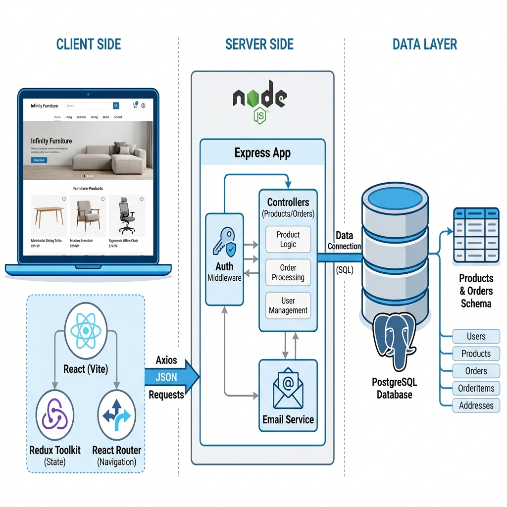

# Infinity Furniture - System Architecture



## 1. High-Level Overview

The **Infinity Furniture** application is a decoupled full-stack web application designed for browsing and purchasing furniture products. It utilizes a **RESTful API** architecture where the frontend (React) consumes data from the backend (Node.js/Express).

### Core Statistics
*   **Architecture Type**: Client-Server (Three-Tier)
*   **Frontend**: React (Vite) + Redux Toolkit
*   **Backend**: Node.js + Express
*   **Database**: PostgreSQL
*   **Communication**: JSON via HTTP

---

## 2. Component Architecture Diagram

The following diagram illustrates the specific modules, data flows, and structural components of your project.

```mermaid
graph TD
    %% Styling
    classDef react fill:#61dafb,stroke:#282c34,stroke-width:2px,color:black
    classDef node fill:#68a063,stroke:#333,stroke-width:2px,color:white
    classDef db fill:#336791,stroke:#333,stroke-width:2px,color:white
    classDef redux fill:#764abc,stroke:#333,stroke-width:2px,color:white

    subgraph Client [Frontend (Port 5173)]
        direction TB
        App[App.jsx - Router]:::react
        
        subgraph Views [Pages]
            Home[Home]:::react
            Shop[Shop]:::react
            ProductView[View /:id]:::react
            Checkout[Checkout]:::react
            Confirm[Confirmation]:::react
        end
        
        subgraph State [Redux Store]
            Store[store.js]:::redux
            CartSlice[cartSlice]:::redux
            Actions[Actions: add/remove/clearCart]:::redux
        end
    end

    subgraph Server [Backend (Port 5000)]
        direction TB
        ServerEntry[server.js]:::node
        
        subgraph Routes [API Routes]
            ProductRouter[/api/products]:::node
            OrderRouter[/api/send-confirmation]:::node
            MiscRouter[/api/contact & /api/newsletter]:::node
        end
        
        subgraph Controllers [Logic Layer]
            ProdCtrl[productController.js]:::node
            OrderCtrl[orderController.js]:::node
            EmailService[emailService.js]:::node
        end
    end

    subgraph Data [Persistence]
        DB[(PostgreSQL)]:::db
        TableProducts[Table: products]:::db
    end

    %% Routing Flow
    App --> Home
    App --> Shop
    App --> Checkout
    
    %% User Interactions
    Shop -->|Dispatch addToCart| CartSlice
    CartSlice -->|Update State| Store
    Store -->|Re-render| Shop
    
    %% Data Fetching Flow (Products)
    Shop -->|GET /api/products| ServerEntry
    ServerEntry --> ProductRouter
    ProductRouter -->|getProducts| ProdCtrl
    ProdCtrl -->|Query SELECT *| DB
    DB -->|Return Rows| ProdCtrl
    ProdCtrl -->|JSON Response| Shop
    
    %% Order Flow
    Checkout -->|POST /api/send-confirmation| ServerEntry
    ServerEntry --> OrderRouter
    OrderRouter -->|createOrder| OrderCtrl
    OrderCtrl -->|Send Email| EmailService
    OrderCtrl -->|Success URL| Confirm
```

---

## 3. Detailed Component Breakdown

### Frontend Layer (User Experience)
*   **Routing (`App.jsx`)**: manages navigation using `react-router-dom`.
    *   `/`: Landing page with featured products.
    *   `/shop`: Main catalog fetching products from API.
    *   `/view/:id`: Dynamic product detail page.
    *   `/checkout`: Form for user details and order submission.
*   **State Management (`redux/`)**:
    *   **`store.js`**: Centralized state container.
    *   **`cartSlice.js`**: Manages the shopping cart.
        *   `addToCart`: Adds item or increments quantity.
        *   `removeFromCart`: Removes item by ID.
        *   `totalQuantity`: Tracks global cart count for navbar badge.

### Backend Layer (Business Logic)
*   **Initialization (`server.js`)**: Configures Express, CORS middleware, and mounts routes at `/api`.
*   **Routes (`routes/`)**:
    *   **`productRoutes.js`**: Maps `GET /products` to the controller.
    *   **`orderRoutes.js`**: Maps `POST /send-confirmation` to the controller.
*   **Controllers (`controllers/`)**:
    *   **`productController.js`**: Executes SQL query `SELECT * FROM products` via connection pool.
    *   **`orderController.js`**: Handles incoming order data and triggers the `emailService` to send confirmation (simulating order processing).

### Data Layer (Storage)
*   **Technology**: PostgreSQL.
*   **Schema**:
    *   **`products` table**:
        *   `id` (Serial PK): Unique identifier.
        *   `name`, `price`, `original_price`: Product metadata.
        *   `img1`, `img2`: Asset paths for frontend display.

---

## 4. Key Data Flows

### A. Loading the Shop Page
1.  User navigates to `/shop`.
2.  `Shop.jsx` component mounts and fires a `useEffect` hook.
3.  Axios/Fetch sends `GET http://localhost:5000/api/products`.
4.  **Backend** receives request -> `productRoutes` -> `productController`.
5.  `productController` runs pool query `SELECT * FROM products`.
6.  Database returns lists of products.
7.  Backend responds with JSON array.
8.  **Frontend** updates local state and maps array to `ProductCard` components.

### B. Placing an Order
1.  User proceeds to `/checkout` and clicks "Place Order".
2.  Frontend collects form data and cart items.
3.  Axios/Fetch sends `POST http://localhost:5000/api/send-confirmation`.
4.  **Backend** receives request -> `orderRoutes` -> `orderController`.
5.  `orderController` calls `emailService.sendOrderConfirmation(data)`.
6.  Backend returns `{ success: true }`.
7.  Frontend navigates user to `/confirmation` page.
